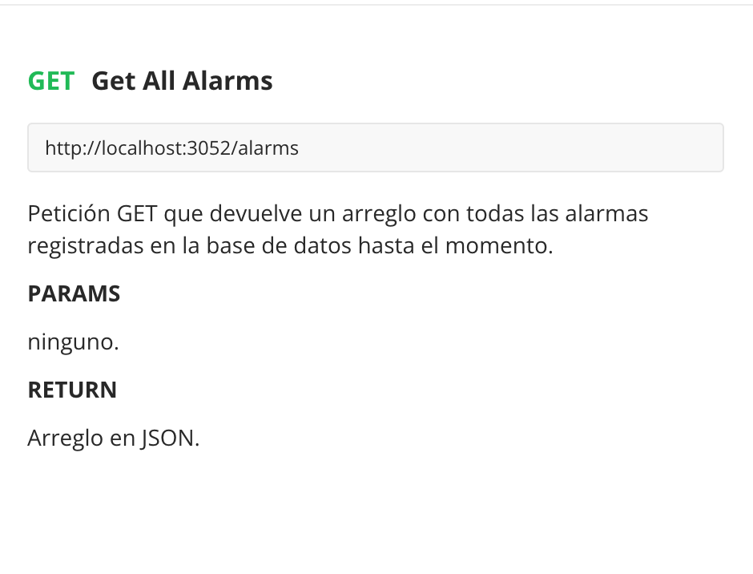

# Ocean Friend API

OceanFriend API es el conjunto de servicios a consumir para el front[ OceanFriend FRONT](https://github.com/richirrim/ocean_friend_front).

Contiene la configuración requerida para conectarse a la base de datos implementada en Postgress y configurada con Prisma.

Adicionalmente contiene algunas otras implementaciones que se detallarán más adelante.

### Instalación del proyecto

Habiendo clonado el proyecto por alguna herramienta como SSH o Git Clone en un ambiente local desde este repositorio, hacer lo siguiente:

1. Instalar las dependencias del proyecto.

   
2. Usando una terminal o Power Shell (dependiendo del OS), crear una base de datos en PostgresSQL que tenga por nombre ocean_friend_bd.
   
3. Configurar las variables de ambiente en el archivo .env creado por Prisma con las credenciales necesarias para conectarse a la base de datos creada en PostgresSQL según como indica la imagen:

   
4. Posicionándonos en la branch develop, iniciar prisma con el siguiente comando para echar a andar una migración que creará las tablas "Alarm" y "User" respectivamente en la base de datos:

   
   
5. El siguiente paso será correr el seeder que se encuentra en prisma/seed.js . El presente archivo contiene algunas inserciones de registros a la base de datos.
   
6. Una vez estén listos todos los puntos anteriores, será el momento de echar a andar el servidor.
   Para eso se debe ejecutar el comando `npm run server` el cual automáticamente "encenderá" el mismo.

   

---

### ¿Qué es npx?

Es una herramienta de cli que nos permite ejecutar paquetes de npm de forma mucho más sencilla.

Por ejemplo, si se quisiera buscar ESLint en el proyecto, antes habría que buscar el binario en node_modules y entonces accerder al archivo, por ejemplo:

```
./node_modules/.bin/eslint yourfile.js
```

Npx lo busca por nosotros:

```
npx eslint yourfile.js
```

De igual manera, npx también es capaz de ejecutar el paquete indicado sin tenerlo previamente instalado.

---

### CRUD

Create, Read, Update, Delete, son las funciones para la gestión de cualquier información en una base de datos.

### ¿Qué es PrismaDB?

**Prisma** es un kit de herramientas de base de datos open source. Reemplaza los ORM tradicionales y facilita el acceso a la base de datos con un generador de consultas o query builder automáticamente generado y type-safe que se adapta a nuestro esquema de base de datos.

### ¿Qué es una migración?

Una migración es algo parecido a un control de versiones, pero para una base de datos. Una migración trackea los cambios de la BD tanto en el código de un proyecto como en la misma BD.

También funcionan como una propagación de cambios en los modelos que se ven reflejados en el esquema de una base de datos. Es decir, son archivos que contienen la estructura de una tabla. Con ellas podemos crear una nueva o modificar los campos que la componen, ejecutarla a través de la consola y el cambio se reflejará inmediatamente en la base de datos.

Cabe aclarar que las migraciones sólo alteran la estructura de las tablas, no agregan ni modifican datos directamente, para esto tenemos los “seeders” y este ya es otro término totalmente aparte.

Las migraciones del presente proyecto se encuentran en **prisma/migrations**.

### Sobre la BD de este proyecto.

#### Modelos

Los modelados de la base de datos quedaron de la siguiente manera:


**User** {

    Id de tipo numérico autoincremental

    username de tipo String y único

    password de tipo String

    dateCreated de tipo Date

    lastUpdatedDateTime de tipo Date

}

**Alarm** {

    Id  de tipo numérico autoincremental

    description de tipo String

    location de tipo String

    photo de tipo String

    isSeen de tipo Boolean

    isAttended de tipo Boolean

    dateCreated de tipo Date

    lastUpdatedDateTime de tipo Date

}

#### Tablas

Estos son los esquemas de las tablas Alarm y User de la Base de Datos respectivamente.


---

### Servicios

Los servicios implementados para el proyecto se encuentran en app/services/ los cuales pueden consultarse en el siguiente enlace a la documentación de [PostMan](https://documenter.getpostman.com/view/20762518/UyxjF5uh):



**Implementación en Javascript**:

```javascript
var requestOptions = {
  method: 'GET',
  redirect: 'follow'
};
```

`fetch("http://localhost:3052/alarms", requestOptions)   .then(response => response.text())   .then(result => console.log(result))   .catch(error => console.log('error', error))`


**Implementación en Javascript:**

`var requestOptions = {   method: 'GET',   redirect: 'follow' };`

`fetch("http://localhost:3052/alarms/last", requestOptions)   .then(response => response.text())   .then(result => console.log(result))   .catch(error => console.log('error', error));`


**Implementación en Javascript:**

`var requestOptions = {   method: 'PUT',   body: raw,   redirect: 'follow' };`

`fetch("http://localhost:3052/alarms/seen/4", requestOptions)   .then(response => response.text())   .then(result => console.log(result))   .catch(error => console.log('error', error));`


**Implementación en Javascript:**
`var requestOptions = {  method: 'PUT',   body: raw,   redirect: 'follow' };`

`fetch("http://localhost:3052/alarms/attend/4", requestOptions)   .then(response => response.text())   .then(result => console.log(result))   .catch(error => console.log('error', error));`


**Implementación en Javascript:**

`var raw = "{\n    `

`var requestOptions = {
  method: 'POST',
  body: raw,
  redirect: 'follow'
}`;

`fetch("http://localhost:3052/alarms/create", requestOptions)
  .then(response => response.text())
  .then(result => console.log(result))
  .catch(error => console.log('error', error));`


**Implementación en Javascript:**
`var requestOptions = {   method: 'DELETE',   redirect: 'follow' };`

`fetch("http://localhost:3052/alarms/1", requestOptions)
  .then(response => response.text())
  .then(result => console.log(result))
  .catch(error => console.log('error', error));`


---

### Dependencias

Las dependencias instaladas en el proyecto se enlistan a continuación:

* ***express**:* es un framework escrito en JavaScript y alojado dentro del entorno de ejecución NodeJS que permite crear aplicaciones web.
* ***jest***: es un marco de prueba para Javascript que permite el desarrollo de pruebas dentro de las aplicaciones.
* ***bcrypt***: es una función de hashing de passwords diseñado por Niels Provos y David Maxieres. Lleva incorporado un valor llamado  **salt** , que es un fragmento aleatorio que se usará para generar el hash asociado a la password, y se guardará junto con ella en la base de datos. La librería bcrypt nos permite elegir el valor de  **saltRounds** , que nos da el control sobre el coste de procesado de los datos.
* ***prisma***: Toolkit de base de datos para proyectos con NodeJS. Funciona como un ORM de open-source.
* ***dotenv***: es un módulo que permite cargar variables de ambiente (de un archivo .env) a través de process.env .

---
